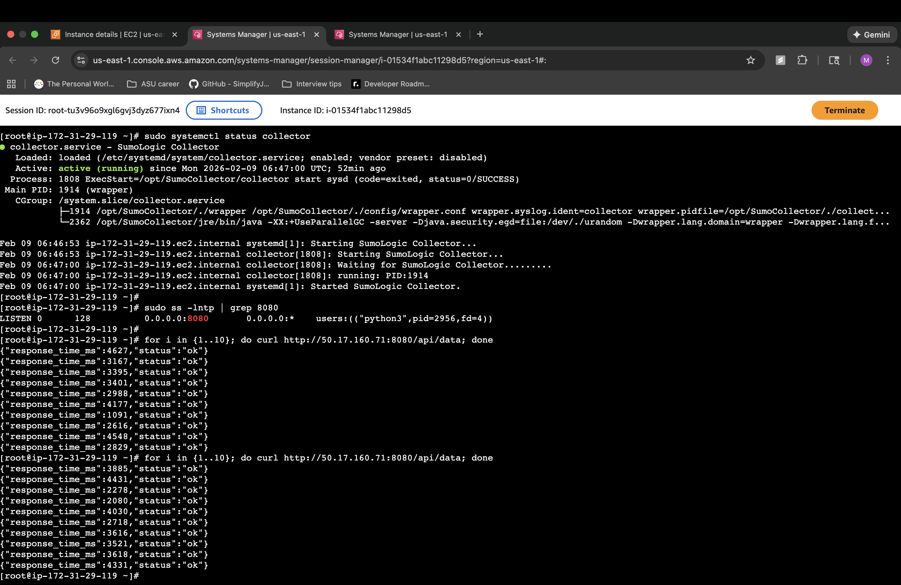
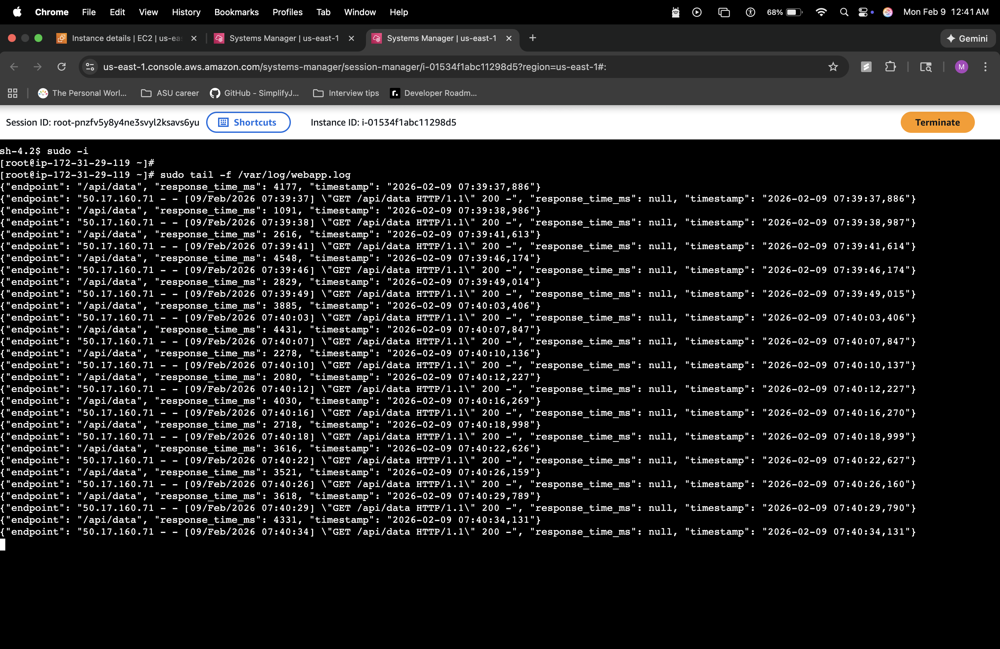
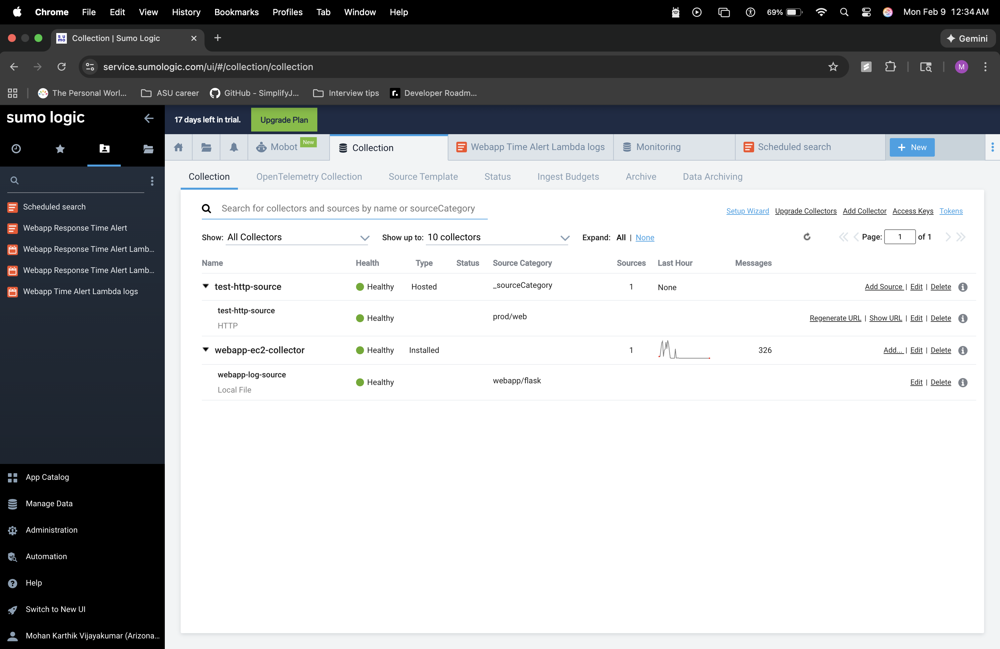
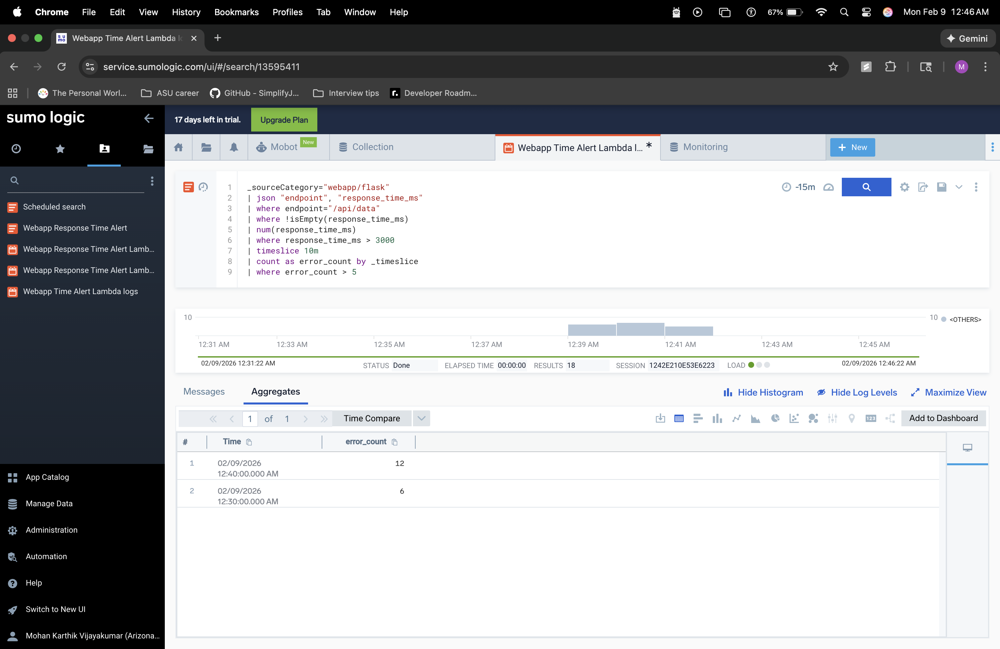
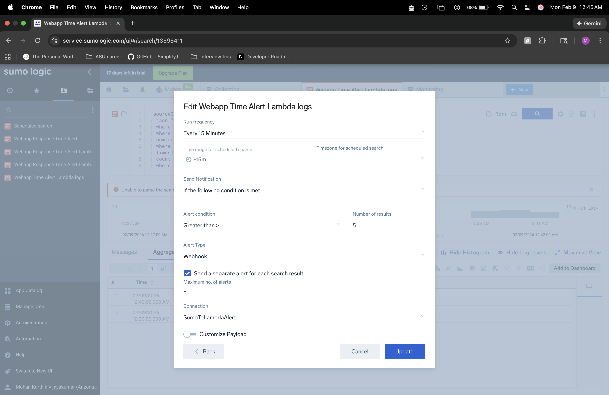
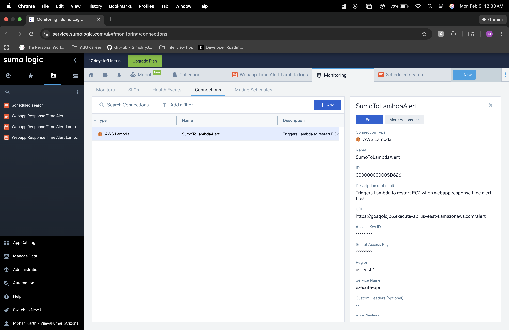
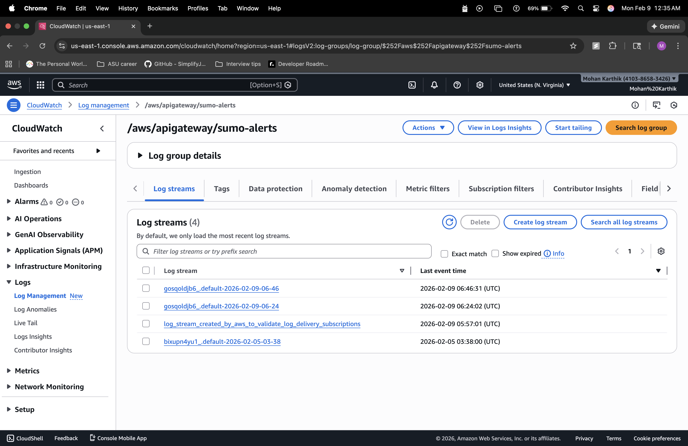
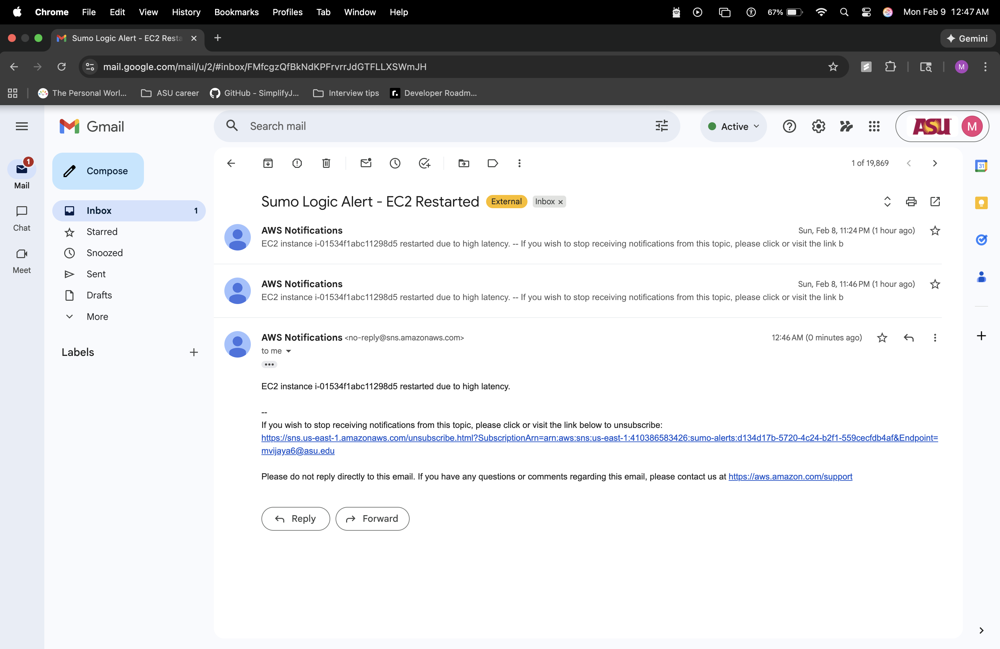

# Sumo Logic → AWS Lambda → EC2 Auto-Remediation (Response Time Monitoring)

## Project Summary
This project implements an automated monitoring and remediation workflow for a web application that experiences intermittent performance issues.

The goal is to detect when the `/api/data` endpoint response time exceeds **3 seconds**, and if more than **5 such events occur within a 10-minute window**, automatically trigger an AWS Lambda function.

The Lambda function performs the following actions:
- Restarts (reboots) a specific EC2 instance
- Logs the action in CloudWatch Logs
- Sends an email notification through Amazon SNS

This solution demonstrates monitoring + alerting + automated remediation using Sumo Logic and AWS.

---

## Architecture (End-to-End Flow)

1. A Flask web app runs on an EC2 instance and exposes the endpoint:
   - `GET /api/data`

2. The web app logs response time in milliseconds.

3. Logs are ingested into Sumo Logic.

4. A Sumo Logic scheduled search checks every 10 minutes:
   - Response time > 3000ms
   - More than 5 matching logs

5. When the condition is met, Sumo Logic sends a webhook alert to:
   - AWS API Gateway HTTP API endpoint (`POST /alert`)

6. API Gateway triggers AWS Lambda.

7. Lambda:
   - Reboots the EC2 instance
   - Publishes a message to SNS (email)

---

## Repository Structure
  ```
    sumo-logic-ec2-auto-remediation/
    ├── README.md
    ├── sumo_logic_query.txt
    ├── lambda_function/
    │   └── index.py
    ├── terraform/
    │   ├── main.tf
    │   ├── variables.tf
    │   ├── outputs.tf
    │   └── user_data.sh
    └── recordings/
        └── links.txt
  ```


---

## Part 1 — Sumo Logic Query and Alert

### Objective
Detect slow API responses from `/api/data` where:
- response time > 3 seconds (3000ms)

Trigger an alert when:
- more than 5 such events occur in 10 minutes

### Query File
The Sumo Logic query used for detection is stored in:
- `sumo_logic_query.txt`

### Alert Setup
In Sumo Logic:
- A scheduled search was created
- Time range: `-10m`
- Frequency: every 10 minutes
- Condition: `count > 5`
- Alert type: Webhook
- Connection: AWS API Gateway webhook endpoint

---

## Part 2 — AWS Lambda Function

### Objective
When triggered by the Sumo alert, Lambda should:
- reboot a specified EC2 instance
- log the action
- send an SNS notification

### Lambda Code Location
- `lambda_function/index.py`

### Lambda Environment Variables
Lambda uses these environment variables:
- `EC2_INSTANCE_ID` → EC2 instance to reboot
- `SNS_TOPIC_ARN` → SNS topic for email notification

### Lambda Behavior
When invoked:
1. Logs the full incoming event payload (for audit/debug)
2. Calls `ec2.reboot_instances()`
3. Publishes an SNS message
4. Returns HTTP 200 to API Gateway

---

## Part 3 — Infrastructure as Code (Terraform)

Terraform provisions the following resources:
- EC2 instance running Flask web app
- Security group
- SNS topic + email subscription
- IAM role + policy for Lambda
- Lambda function
- API Gateway HTTP API (POST /alert)
- Lambda permission for API Gateway invocation

Terraform code is stored in:
- `terraform/`

---

## Deployment Instructions (Terraform)

### Step 1 — Configure Variables
Create a file:

`terraform/terraform.tfvars`

Example:

```hcl
region        = "us-east-1"
instance_type = "t2.micro"
email_alert   = "your-email@example.com"
```

# Deploy

```bash
cd terraform
terraform init
terraform validate
terraform apply
```

# Testing the System

## 1) Test the Web App
```bash
curl http://<EC2_PUBLIC_IP>:8080/api/data
```

- Example output:
```
{"response_time_ms":4855,"status":"ok"}
```

## 2) Generate Multiple Requests (simulate spike)
```
for i in {1..20}; do curl -s http://<EC2_PUBLIC_IP>:8080/api/data > /dev/null; done
```

## 3) Verify Logs in Sumo Logic
```
Confirm /api/data logs appear
```
Run the scheduled search manually to confirm matches

## 4) Confirm Sumo Alert Triggered Webhook

- API Gateway Access Logs (CloudWatch log group):

- `/aws/apigateway/sumo-alerts`

## 5) Confirm Lambda Executed

- Lambda CloudWatch log group:

- `/aws/lambda/sumo-restart-ec2`

## 6) Confirm SNS Email Notification

- SNS topic sends an email when Lambda runs successfully.


## Screenshots (Proof)

### 1) Web App Running + API Calls


### 2) Web App Logs Showing Response Time


### 3) Sumo Logic Collector Configured


### 4) Sumo Logic Query (Response Time > 3s)



### 5) Sumo Logic Webhook Alert Setup


### 6) Sumo Logic Connection to API Gateway


### 7) API Gateway CloudWatch Logs (Webhook Received)


### 8) SNS Notification Email Received



# Troubleshooting Notes
- Issue: EC2 web app stops after reboot

- A reboot kills the running Flask process if it is not managed by systemd.

### Fix:

- Create a systemd service (webapp.service)

- Enable it so the app auto-starts after reboot

### Commands:
```
sudo systemctl daemon-reload
sudo systemctl enable webapp
sudo systemctl start webapp
sudo systemctl status webapp
```

# Deliverables Included

✅ Sumo Logic query and alert logic

✅ Lambda function code

✅ Terraform IaC deployment

✅ API Gateway webhook integration

✅ SNS notifications

✅ Recording links

# Author

`Mohan Karthik Vijayakumar`
